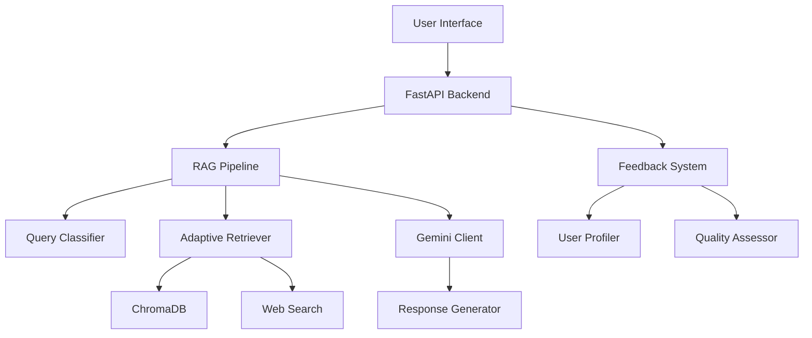

# 🚀 RAG-NITEC: Advanced RAG System with RLHF

<div align="center">


**An intelligent RAG system with adaptive learning for Kazakh government services**

[🎯 Features](#-features) • [🚀 Quick Start](#-quick-start) • [📖 Documentation](#-documentation) • [🛠️ Development](#-development)

</div>

## 📋 Table of Contents

- [🎯 Features](#-features)
- [🏗️ Architecture](#️-architecture)
- [🚀 Quick Start](#-quick-start)
- [⚙️ Installation](#️-installation)
- [🔧 Configuration](#-configuration)
- [📖 API Documentation](#-api-documentation)
- [🌐 Web Interface](#-web-interface)
- [🛠️ Development](#-development)
- [📊 Analytics & Monitoring](#-analytics--monitoring)
- [🔄 Feedback System](#-feedback-system)
- [🤖 AI Components](#-ai-components)
- [📁 Project Structure](#-project-structure)
- [🧪 Testing](#-testing)
- [🚀 Deployment](#-deployment)
- [🤝 Contributing](#-contributing)
- [📄 License](#-license)

## 🎯 Features

### 🧠 **Advanced AI Capabilities**
- **Multi-Modal RAG Pipeline** - Semantic + keyword search with adaptive ranking
- **Intent Classification** - Neural network-based query understanding
- **Context-Aware Responses** - Session-based conversation memory
- **Quality Assessment** - Automated response quality evaluation
- **Confidence Scoring** - Multi-factor confidence calculation

### 🔄 **Adaptive Learning**
- **RLHF Integration** - Reinforcement learning from human feedback
- **Real-time Model Updates** - Continuous improvement from user interactions
- **User Profiling** - Personalized experience based on usage patterns
- **Performance Optimization** - Automatic parameter tuning

### 🌐 **Web Search Integration**
- **Intelligent Web Search** - Authority-based source ranking
- **Content Extraction** - Full-page content analysis
- **Freshness Scoring** - Time-aware information relevance
- **Multi-Source Fusion** - Combining local and web knowledge

### 📊 **Analytics Dashboard**
- **Real-time Metrics** - Live system performance monitoring
- **User Analytics** - Detailed interaction statistics
- **Quality Insights** - Response quality trends
- **System Health** - Resource usage and performance metrics

### 🎨 **Modern UI/UX**
- **Responsive Design** - Mobile-first interface
- **Dark/Light Themes** - Customizable appearance
- **Real-time Chat** - Instant response delivery
- **Interactive Feedback** - Easy rating and correction system

## 🏗️ Architecture



### Core Components

| Component | Description | Technology |
|-----------|-------------|------------|
| **RAG Pipeline** | Advanced retrieval-augmented generation | LangChain + Custom Logic |
| **Vector Database** | Document embeddings storage | ChromaDB |
| **Query Classifier** | Intent recognition neural network | PyTorch |
| **Gemini Client** | Google's Gemini AI integration | Google Generative AI |
| **Web Search** | Intelligent external knowledge retrieval | Custom + BeautifulSoup |
| **Feedback System** | RLHF and quality assessment | Custom Implementation |

## 🚀 Quick Start

### Prerequisites
- Python 3.8+
- 4GB+ RAM
- Google AI API Key

### 1. Clone & Install
```bash
git clone https://github.com/AdilzhanB/RAG-NITEC.git
cd RAG-NITEC
pip install -r requirements.txt
```

### 2. Configure Environment
```bash
# Create .env file
echo "GOOGLE_AI_API_KEY=your_gemini_api_key_here" > .env
echo "ENVIRONMENT=development" >> .env
```

### 3. Run the Application
```bash
# Start the server
uvicorn main:app --reload --host 0.0.0.0 --port 8000

# Open in browser
# http://localhost:8000
```

## ⚙️ Installation

###  Standard Installation
```bash
# Clone repository
git clone https://github.com/AdilzhanB/RAG-NITEC.git
cd RAG-NITEC

# Create virtual environment
python -m venv venv
source venv/bin/activate  # Windows: venv\Scripts\activate

# Install dependencies
pip install -r requirements.txt
```

## 🔧 Configuration

### Environment Variables

```env
# AI Configuration
GOOGLE_AI_API_KEY=your_gemini_api_key
EMBEDDING_MODEL=all-MiniLM-L6-v2
CHUNK_SIZE=1000
CHUNK_OVERLAP=200
TOP_K_DOCUMENTS=10

# Server Configuration
HOST=0.0.0.0
PORT=8000
ENVIRONMENT=production
LOG_LEVEL=INFO

# Database Configuration
CHROMA_PERSIST_DIRECTORY=./models/chroma
MODELS_DIR=./models

# Performance Configuration
MAX_CONCURRENT_REQUESTS=100
CACHE_SIZE=1000
SESSION_TIMEOUT=3600
```

### Model Configuration

```python
# config.py
class RAGConfig:
    # Model parameters
    EMBEDDING_MODEL = "sentence-transformers/all-MiniLM-L6-v2"
    CHUNK_SIZE = 1000
    CHUNK_OVERLAP = 200
    TOP_K_DOCUMENTS = 10
    
    # Quality thresholds
    MIN_CONFIDENCE_THRESHOLD = 0.7
    MIN_FEEDBACK_FOR_TRAINING = 50
    
    # Performance settings
    MAX_CONTEXT_LENGTH = 2000
    RESPONSE_TIMEOUT = 30
```

## 📖 API Documentation

### Core Endpoints

#### Chat API
```http
POST /api/chat
Content-Type: application/json

{
    "query": "Как получить справку о несудимости?",
    "user_id": "user123",
    "session_id": "session456",
    "priority": "high"
}
```

**Response:**
```json
{
    "response": "Для получения справки о несудимости...",
    "interaction_id": "uuid-123",
    "confidence": 0.95,
    "intent": "procedural",
    "sources": ["egov.kz", "adilet.zan.kz"],
    "processing_time": 1.23,
    "quality_assessment": "excellent",
    "suggestions": ["Хотите узнать о сроках?"],
    "follow_up_questions": ["Нужна информация о документах?"]
}
```

#### Feedback API
```http
POST /api/feedback
Content-Type: application/json

{
    "interaction_id": "uuid-123",
    "feedback_type": "rating",
    "rating": 5,
    "correction": "Добавить информацию о сроках",
    "explanation": "Ответ был полезен"
}
```

#### Analytics API
```http
GET /api/analytics/stats
```

**Response:**
```json
{
    "document_metrics": {
        "total_documents": 1500,
        "last_indexed": "2025-06-21T08:16:04Z"
    },
    "interaction_metrics": {
        "total_interactions": 5000,
        "active_users": 150,
        "avg_confidence": 0.847,
        "avg_processing_time": 1.2
    },
    "quality_distribution": {
        "excellent": 45,
        "good": 35,
        "average": 15,
        "poor": 5
    }
}
```

### Search API
```http
POST /api/search
Content-Type: application/json

{
    "query": "электронные услуги",
    "max_results": 10,
    "priority": "high"
}
```

## 🌐 Web Interface

### Main Features

#### 🎨 **Modern Chat Interface**
- Real-time messaging with typing indicators
- Message history with search
- File upload support
- Voice input capability

#### 📊 **Analytics Dashboard**
- **Performance Metrics**: Response times, accuracy rates
- **Usage Statistics**: User activity, popular queries
- **Quality Insights**: Feedback trends, improvement areas
- **System Health**: Resource usage, error rates

#### ⚙️ **Settings Panel**
- **Theme Customization**: Light/dark mode, color schemes
- **Model Parameters**: Temperature, top-k, max tokens
- **Feedback Settings**: Auto-feedback, correction modes
- **Export Options**: Chat history, analytics data

### UI Components

```javascript
// Chat Interface
class ChatInterface {
    constructor() {
        this.messageHistory = [];
        this.currentSession = null;
        this.settings = new SettingsManager();
    }
    
    async sendMessage(query) {
        const response = await fetch('/api/chat', {
            method: 'POST',
            headers: {'Content-Type': 'application/json'},
            body: JSON.stringify({
                query: query,
                user_id: this.userId,
                session_id: this.currentSession
            })
        });
        return response.json();
    }
}
```

## 🛠️ Development

### Project Structure
```
RAG-NITEC/
├── 📁 src/                     # Core application logic
│   ├── 🐍 rag_pipeline.py      # Main RAG implementation
│   ├── 🐍 gemini_client.py     # Google Gemini integration
│   ├── 🐍 web_search.py        # Web search functionality
│   ├── 🐍 feedback_system.py   # RLHF implementation
│   └── 🐍 data_loader.py       # Document processing
├── 📁 static/                  # Frontend assets
│   ├── 🎨 styles.css          # CSS styling
│   ├── ⚡ script.js           # JavaScript logic
│   └── 🌐 index.html          # Main interface
├── 📁 models/                  # ML models and data
│   ├── 📁 chroma/             # Vector database
│   └── 🧠 query_classifier.pth # Trained models
├── 📁 documents/               # Knowledge base
├── 🐍 main.py                 # FastAPI application
├── 📋 requirements.txt        # Dependencies
└── 📖 README.md              # This file
```

### Key Classes

#### RAG Pipeline
```python
class AdvancedRAGPipeline:
    """Main RAG implementation with adaptive learning"""
    
    def __init__(self):
        self.embedding_model = SentenceTransformer(EMBEDDING_MODEL)
        self.query_classifier = QueryClassifier()
        self.retriever = AdaptiveRetriever()
        self.gemini_client = AdvancedGeminiClient()
        
    async def process_query(self, query: str, user_id: str) -> Dict:
        # 1. Intent analysis
        intent = await self._analyze_query_intent(query)
        
        # 2. Document retrieval
        docs = await self.retriever.retrieve_documents(query, intent)
        
        # 3. Response generation
        response = await self.gemini_client.generate_response(query, docs)
        
        # 4. Quality assessment
        quality = await self._assess_response_quality(response)
        
        return {
            'response': response,
            'confidence': self._calculate_confidence(docs, quality),
            'sources': self._extract_sources(docs)
        }
```

#### Adaptive Retriever
```python
class AdaptiveRetriever:
    """Retriever with feedback-based learning"""
    
    def __init__(self, embedding_model, collection):
        self.embedding_model = embedding_model
        self.collection = collection
        self.performance_history = deque(maxlen=1000)
        
    async def retrieve_documents(self, query: str, intent: QueryIntent) -> List[Dict]:
        # Hybrid search: semantic + keyword
        semantic_results = await self._semantic_search(query)
        keyword_results = await self._keyword_search(query)
        
        # Adaptive ranking based on feedback
        combined_docs = self._merge_results(semantic_results, keyword_results)
        ranked_docs = await self._adaptive_ranking(combined_docs, intent)
        
        return ranked_docs
```

### Development Workflow

```bash
# 1. Setup development environment
python -m venv venv
source venv/bin/activate
pip install -r requirements.txt

# 2. Run in development mode
uvicorn main:app --reload --log-level debug

# 3. Run tests
pytest tests/ -v --cov=src/

# 4. Code quality checks
flake8 src/
black src/
mypy src/

# 5. Update documentation
sphinx-build -b html docs/ docs/_build/
```

## 📊 Analytics & Monitoring

### Performance Metrics

```python
@app.get("/api/analytics/performance")
async def get_performance_metrics():
    return {
        "response_times": {
            "avg": 1.2,
            "p95": 2.1,
            "p99": 3.5
        },
        "accuracy_metrics": {
            "intent_classification": 0.94,
            "document_relevance": 0.87,
            "response_quality": 0.91
        },
        "system_health": {
            "memory_usage": "512MB",
            "cpu_usage": "23%",
            "disk_usage": "2.1GB"
        }
    }
```

### Real-time Dashboard

The analytics dashboard provides:

- 📈 **Live Metrics**: Real-time performance indicators
- 👥 **User Analytics**: Active users, session duration
- 🎯 **Query Insights**: Popular queries, intent distribution
- 🔍 **Quality Trends**: Response quality over time
- 🚨 **Alert System**: Performance threshold monitoring

### Monitoring Setup

```yaml
# monitoring.yml
version: '3.8'
services:
  prometheus:
    image: prom/prometheus
    ports:
      - "9090:9090"
    volumes:
      - ./prometheus.yml:/etc/prometheus/prometheus.yml
      
  grafana:
    image: grafana/grafana
    ports:
      - "3000:3000"
    environment:
      - GF_SECURITY_ADMIN_PASSWORD=admin
```

## 🔄 Feedback System

### RLHF Implementation

```python
class AdvancedFeedbackSystem:
    """Reinforcement Learning from Human Feedback"""
    
    async def process_feedback(self, interaction_id: str, feedback_data: Dict):
        # 1. Validate feedback
        validated_feedback = await self.validator.validate_feedback(feedback_data)
        
        # 2. Update user profile
        await self._update_user_profile(interaction_id, validated_feedback)
        
        # 3. Trigger adaptive learning
        if self._should_retrain():
            await self._trigger_retraining()
            
        return {"status": "processed", "feedback_id": str(uuid.uuid4())}
```

### Feedback Types

| Type | Description | Example |
|------|-------------|---------|
| **Rating** | 1-5 star rating | ⭐⭐⭐⭐⭐ |
| **Like/Dislike** | Binary feedback | 👍 / 👎 |
| **Correction** | Text correction | "Срок должен быть 10 дней" |
| **Suggestion** | Improvement suggestion | "Добавить ссылку на форму" |
| **Explanation** | Detailed feedback | "Ответ неполный, не хватает..." |

### Quality Assessment

```python
async def assess_response_quality(self, query: str, response: str, docs: List[Dict]) -> ResponseQuality:
    metrics = {
        'length_appropriate': 50 <= len(response) <= 2000,
        'contains_facts': any(doc.get('score', 0) > 0.7 for doc in docs),
        'coherent': len(response.split('.')) >= 2,
        'no_hallucinations': not self._detect_hallucinations(response),
        'keyword_coverage': self._calculate_keyword_coverage(query, response)
    }
    
    score = sum(metrics.values())
    
    if score >= 4: return ResponseQuality.EXCELLENT
    elif score >= 3: return ResponseQuality.GOOD
    elif score >= 2: return ResponseQuality.AVERAGE
    else: return ResponseQuality.POOR
```

## 🤖 AI Components

### Google Gemini Integration

```python
class AdvancedGeminiClient:
    """Enhanced Gemini AI client with response optimization"""
    
    def __init__(self):
        genai.configure(api_key=os.getenv("GOOGLE_AI_API_KEY"))
        self.model = genai.GenerativeModel('gemini-pro')
        self.cache = TTLCache(maxsize=1000, ttl=3600)
        
    async def generate_advanced_response(self, query: str, context: str, intent: QueryIntent):
        # 1. Prepare enhanced prompt
        prompt = self._create_context_aware_prompt(query, context, intent)
        
        # 2. Generate response with retries
        response = await self._generate_with_retries(prompt)
        
        # 3. Post-process and structure
        structured_response = self._structure_response(response, intent)
        
        return structured_response
```

### Query Classification

```python
class QueryClassifier(nn.Module):
    """Neural network for query intent classification"""
    
    def __init__(self, embedding_dim=384, num_classes=6):
        super().__init__()
        self.classifier = nn.Sequential(
            nn.Linear(embedding_dim, 256),
            nn.ReLU(),
            nn.Dropout(0.3),
            nn.Linear(256, 128),
            nn.ReLU(),
            nn.Dropout(0.2),
            nn.Linear(128, num_classes),
            nn.Softmax(dim=1)
        )
        
    def forward(self, x):
        return self.classifier(x)
```

### Web Search Intelligence

```python
class IntelligentWebSearch:
    """Authority-based web search with content extraction"""
    
    async def intelligent_search(self, query: str, intent: QueryIntent, max_results: int = 5):
        # 1. Optimize search query
        optimized_query = await self.query_optimizer.optimize_for_web(query, intent)
        
        # 2. Multi-source search
        results = await self._multi_source_search(optimized_query)
        
        # 3. Authority scoring
        scored_results = await self._score_authority(results)
        
        # 4. Content extraction
        enriched_results = await self._enrich_with_content(scored_results)
        
        return enriched_results[:max_results]
```

## 🧪 Testing

### Test Suite

```bash
# Run all tests
pytest

# Run with coverage
pytest --cov=src/ --cov-report=html

# Run specific test categories
pytest tests/unit/          # Unit tests
pytest tests/integration/   # Integration tests
pytest tests/e2e/          # End-to-end tests
```

### Test Structure

```python
# tests/test_rag_pipeline.py
@pytest.mark.asyncio
async def test_query_processing():
    pipeline = AdvancedRAGPipeline()
    
    result = await pipeline.process_query(
        query="Как получить паспорт?",
        user_id="test_user"
    )
    
    assert result['confidence'] > 0.5
    assert 'response' in result
    assert len(result['sources']) > 0

# tests/test_feedback_system.py
@pytest.mark.asyncio
async def test_feedback_processing():
    feedback_system = AdvancedFeedbackSystem()
    
    result = await feedback_system.process_feedback(
        interaction_id="test_id",
        feedback_data={"rating": 5, "feedback_type": "positive"}
    )
    
    assert result['status'] == 'processed'
```

### Performance Testing

```python
# tests/performance/load_test.py
import asyncio
import aiohttp
import time

async def load_test(concurrent_requests=50, total_requests=1000):
    async with aiohttp.ClientSession() as session:
        start_time = time.time()
        
        tasks = []
        for i in range(total_requests):
            task = session.post(
                'http://localhost:8000/api/chat',
                json={'query': f'Test query {i}', 'user_id': f'user_{i % concurrent_requests}'}
            )
            tasks.append(task)
            
            if len(tasks) == concurrent_requests:
                await asyncio.gather(*tasks)
                tasks = []
        
        if tasks:
            await asyncio.gather(*tasks)
            
        end_time = time.time()
        print(f"Processed {total_requests} requests in {end_time - start_time:.2f} seconds")
```

## 🚀 Deployment

### Production Deployment

#### Option 1: Docker Deployment
```dockerfile
# Dockerfile
FROM python:3.9-slim

WORKDIR /app

COPY requirements.txt .
RUN pip install --no-cache-dir -r requirements.txt

COPY . .

EXPOSE 8000

CMD ["uvicorn", "main:app", "--host", "0.0.0.0", "--port", "8000", "--workers", "4"]
```

```yaml
# docker-compose.yml
version: '3.8'
services:
  rag-nitec:
    build: .
    ports:
      - "8000:8000"
    environment:
      - GOOGLE_AI_API_KEY=${GOOGLE_AI_API_KEY}
      - ENVIRONMENT=production
    volumes:
      - ./models:/app/models
      - ./documents:/app/documents
    restart: unless-stopped
    
  nginx:
    image: nginx:alpine
    ports:
      - "80:80"
      - "443:443"
    volumes:
      - ./nginx.conf:/etc/nginx/nginx.conf
      - ./ssl:/etc/nginx/ssl
    depends_on:
      - rag-nitec
```

#### Option 2: Cloud Deployment

**Google Cloud Platform:**
```bash
# Build and push to Container Registry
gcloud builds submit --tag gcr.io/PROJECT_ID/rag-nitec

# Deploy to Cloud Run
gcloud run deploy rag-nitec \
  --image gcr.io/PROJECT_ID/rag-nitec \
  --platform managed \
  --region us-central1 \
  --allow-unauthenticated \
  --memory 2Gi \
  --cpu 2
```

**AWS Deployment:**
```bash
# Create ECR repository
aws ecr create-repository --repository-name rag-nitec

# Build and push image
docker build -t rag-nitec .
docker tag rag-nitec:latest ACCOUNT.dkr.ecr.REGION.amazonaws.com/rag-nitec:latest
docker push ACCOUNT.dkr.ecr.REGION.amazonaws.com/rag-nitec:latest

# Deploy to ECS
aws ecs create-service \
  --cluster default \
  --service-name rag-nitec \
  --task-definition rag-nitec:1 \
  --desired-count 2
```

### Environment Configuration

```bash
# Production environment variables
export GOOGLE_AI_API_KEY="your_production_api_key"
export ENVIRONMENT="production"
export LOG_LEVEL="WARNING"
export HOST="0.0.0.0"
export PORT="8000"
export WORKERS="4"

# Database configuration
export CHROMA_PERSIST_DIRECTORY="/app/data/chroma"
export MODELS_DIR="/app/models"

# Performance tuning
export MAX_CONCURRENT_REQUESTS="200"
export CACHE_SIZE="2000"
export SESSION_TIMEOUT="7200"
```

### Scaling Considerations

```python
# Performance optimization
app.add_middleware(
    GZipMiddleware,
    minimum_size=1000
)

app.add_middleware(
    HTTPSRedirectMiddleware
)

# Resource monitoring
@app.middleware("http")
async def monitor_requests(request: Request, call_next):
    start_time = time.time()
    response = await call_next(request)
    process_time = time.time() - start_time
    
    logger.info(f"Request: {request.url} - Time: {process_time:.2f}s")
    return response
```

## 🤝 Contributing

We welcome contributions! Here's how to get started:

### Development Setup

1. **Fork the repository**
2. **Create a feature branch**
   ```bash
   git checkout -b feature/amazing-feature
   ```

3. **Install development dependencies**
   ```bash
   pip install -r requirements-dev.txt
   pre-commit install
   ```

4. **Make your changes**
5. **Run tests**
   ```bash
   pytest tests/ -v
   flake8 src/
   black src/ --check
   ```

6. **Commit and push**
   ```bash
   git commit -m "Add amazing feature"
   git push origin feature/amazing-feature
   ```

7. **Create a Pull Request**

### Contribution Guidelines

- **Code Style**: Follow PEP 8 and use Black formatter
- **Testing**: Add tests for new features
- **Documentation**: Update relevant documentation
- **Commits**: Use conventional commit messages
- **Issues**: Use provided issue templates

### Code Review Process

1. All PRs require at least one review
2. CI/CD checks must pass
3. Test coverage should not decrease
4. Documentation must be updated

## 📄 License

This project is licensed under the MIT License - see the [LICENSE](LICENSE) file for details.

## 🙏 Acknowledgments

- **Google AI** for Gemini API
- **LangChain** for RAG framework
- **ChromaDB** for vector database
- **FastAPI** for web framework
- **Sentence Transformers** for embeddings

## 📞 Support

- 📧 **Email**: baidalin_adilzhan.2010@mail.ru
- 💬 **Issues**: [GitHub Issues](https://github.com/AdilzhanB/RAG-NITEC/issues)
---

<div align="center">

**Built with ❤️ for the future of AI-powered government services**

[⬆ Back to Top](#-rag-nitec-advanced-rag-system-with-rlhf)

</div>
